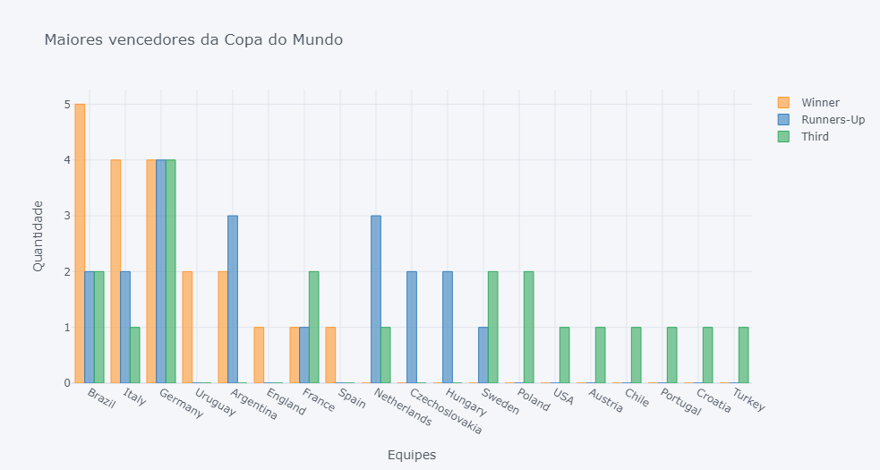
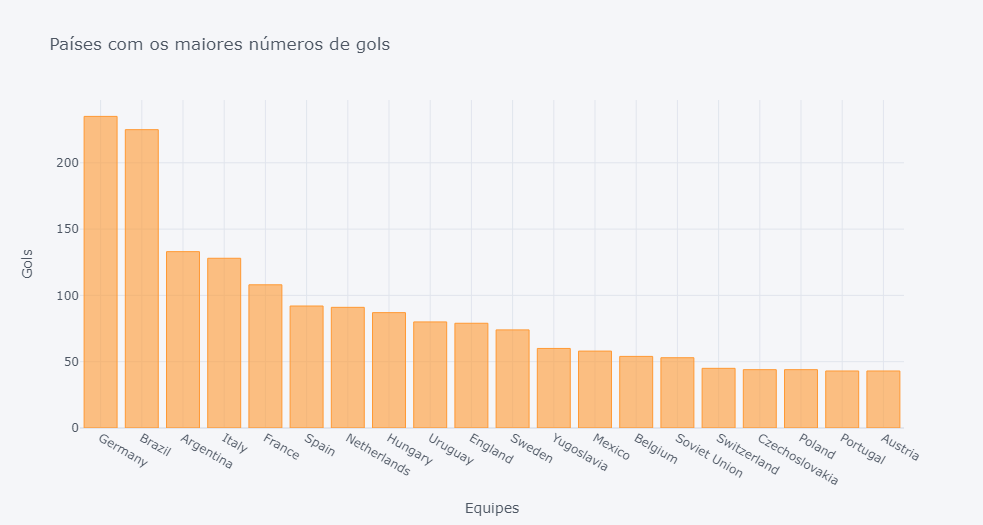
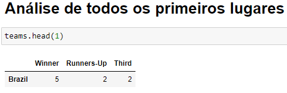

# FIFA WORLD CUP INSIGHTS

Neste projeto iremos realizar um EDA a partir de dataset da Copa do Mundo.

Projeto realizado por mim, Raul Santos Iglesias, com participação da disciplina de Inteligência Artificial. 

## Objetivos

- Prática com jupyter notebook
- Aprendizado com análise de dados
- Explorar e organizar dataset
- Realizar filtros para exibir insights

## Preview

